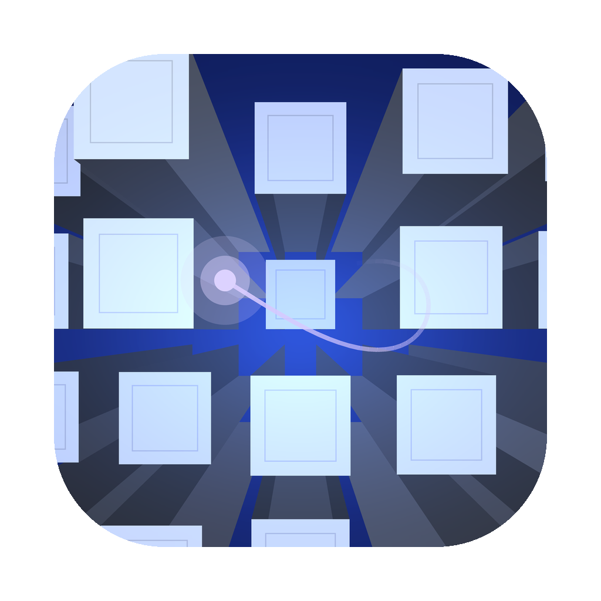

<p align="center"></p>

# PS2 Boot Inspection Tool

A desktop app (Windows, Linux, macOS) that replays the PlayStation 2 start-up from **your own** BIOS dump, memory
card and game disc, and lets you look inside it: what the boot screen is built from, how your
play history shapes it, what the console does between power-on and the moment a game takes over.


Nothing from Sony ships with the app. You bring a BIOS image, a PCSX2 memory card and, if you
want the disc phase, a disc image; the tool reads them at run time.

## What you can inspect

### Memory card data, as towers

The towers in the PS2 boot screen are a picture of the console's play history: every title on
the card owns six slots in a 14×9 grid, a title's first launch plants a tower, and more towers
grow with the number of launches. The tool reads `B?DATA-SYSTEM/history` straight from a PCSX2
card image or folder card and builds the skyline from it, so two cards give two different
boot screens, side by side if you like. A table in the sidebar shows each record — title ID,
launch count, which of its towers exist and which one is still growing.

Cards without a history file (PCSX2 fast boot never writes one) are not a dead end: the tool
can stand in a history made from the titles that have saves on the card, or let you dial in a
synthetic one (titles × launches) to see how the skyline fills up over a console's life.

### A free camera

The console's camera only ever flies straight through. Switch to the free camera to fly around
the field, look at the towers from the side or from above, and see the scripted camera's own
route drawn in space — its rungs, the points where the lettering, the dive, the defocus and the
fade trigger, and its view frustum moving along. Blender's camera controls: middle-drag (or drag) to orbit, Shift for pan, Ctrl or the wheel to
dolly, numpad 1/3/7 for the axis views, Home to frame everything. The route can be exported as CSV.


### The full boot, both phases

*Full boot* plays the whole sequence on one clock:

1. **BIOS phase** — the black period after power-on, with a readout of what the console is
   busy with (IOP boots, loading the OSD program, mounting the card, decoding assets, uploading
   the sound bank), then the opening with your towers, chime and all.
2. **Disc phase** — the hand-over to the disc: the OSD program identifies the disc, reads
   `SYSTEM.CNF`, records the launch in your history and starts `PS2LOGO`; the "PlayStation 2"
   logo plays with the lettering read from the disc's first sectors; then the point where the
   game would start.

For a **PlayStation 1 disc** the second phase is the PS1 licence screen instead: the PS1
shell that lives inside the PS2 BIOS (`rom0:LOGO`) draws the logo model read from the disc's
sectors 5–11, fades it in through the GTE depth cue, then the "PlayStation" wordmark, the
licence line in the kernel's font and the drive's region letters, with the shell's drone and
ascending chime — and the hand-off card follows `PS1DRV` to the PS-X EXE.

The tool stops exactly there and shows what would happen next instead of doing it: the disc's
title ID and type, `SYSTEM.CNF`, the boot executable's location, size, entry point and memory
segments, the logo checksum, how your play history would change, and the chain of named
functions from the OSD program through the kernel and `PS2LOGO` to the first instruction of
the game. The game is never run.


### Time, sound, picture

- Pause, scrub, slow down, loop. Choose when the drive "identifies" the disc and how long the
  hand-over takes — both change the timing the way they do on the console.
- The boot chime is synthesised from the BIOS the way the console's sound chip plays it, placed
  on the same clock as the picture; a volume meter, waveform or 32-band equaliser can be shown
  over it.
- NTSC (60 Hz) or PAL (50 Hz) presentation, chosen from the BIOS region; the console's
  language for the warning text; every layer of the frame can be switched off to study the one
  underneath.
- The red "Please insert a PlayStation or PlayStation 2 format disc" screen is included as its
  own scene.

## Requirements and set-up

- Windows, Linux or macOS (the app is Rust on wgpu, so the three builds come from one code base).
- A PS2 BIOS dump. Supported so far: ROM 2.00 E (SCPH-70004), 1.60 E (SCPH-30004R),
  1.60 A (SCPH-39001) and the DTL-H30101 development kit (1.50 A) — the data tables are
  located by content, so other builds of the same OSD generation should load too. ROM 1.00
  (SCPH-10000) is a different OSD generation and is rejected with a message.
- A PCSX2 memory card (`.ps2` image, with or without ECC, or a folder card). Optional: a game
  disc image (`.iso`, or a raw `.bin`/`.cue` CD rip) for the disc phase and the genuine logo.

```sh
cargo run --release -p ps2bootinspect                    # the app (Rust toolchain from rustup.rs)
cargo run --release -p ps2kit --bin ps2history -- <card>  # dump a card's play history
cargo run --release -p ps2bootinspect -- --render 95 out.png --bios <bios> --titles 21 --launches 60 --pal
cargo test -p ps2kit                                     # checks against the Python tools and the Swift app
```

Pre-built binaries for Windows, Linux and macOS come out of the GitHub Actions workflow
(`.github/workflows/build.yml`) for every push to `main`.

On first start the app looks in PCSX2's `bios` and `memcards` folders (Library/Application
Support, Documents or `~/.config`) and in `~/PS2ISO`; use the *Open…* buttons for other
locations.

The original native macOS app (Swift/Metal) is kept in `app/`; see `app/README.md`. It is
functionally the same but supports only ROM 2.00 E.

## Accuracy

The reconstruction comes from a static reading of the BIOS code; it has not been compared
against real hardware or an emulator capture. Known approximations: the glass cubes are a
two-pass stand-in for the console's ten passes, the chime plays without the console's reverb,
power-on and hand-over durations are estimates, and the orientation of the tower grid on screen
and a possible colour overflow on tower caps are unverified. Details are in the documentation below.

## Documentation

For anyone who wants to check the tool's claims or extend it to another BIOS version:

| | |
|---|---|
| `docs/writeup.md` | The whole boot path in one article, for reading rather than reference. |
| `notes/opening.md` | The tower scene: data, camera, every stage of the frame. |
| `notes/opening_scene1.md` | The warning scene. |
| `notes/boot_sequence.md` | Power-on to the first frame: call tree and timeline. |
| `notes/osdsys_flow.md` | The OSD program's control flow and the play-history file format. |
| `notes/ps2logo.md` | The logo program and the disc's logo sectors. |
| `notes/ps1_boot.md` | The PS1 shell inside the PS2 BIOS: the licence screen, the logo TMD on the disc, its sounds and region rules. |
| `notes/sound.md` | The boot chime: driver, bank and sequence formats. |
| `notes/menu_survey.md` | Survey of the main menu and browser (not re-created). |
| `notes/devkit_survey.md` | What the DTL-H30101 development-kit BIOS does differently (very little). |
| `notes/hidden_features.md` | What every ROM carries that owners never see: the factory test program, the card update hook, the dormant kernel debugger, and what PCSX2 exposes of it. |
| `ps2kit/` | The portable core (Rust): every reader and the simulation, with oracle tests. |
| `ps2bootinspect/` | The app (Rust: egui + wgpu + cpal). |
| `tools/`, `analysis/symbols/` | Scripts that derive all of the above from a BIOS image, and symbol tables for the decompilations they produce. |
| [ps2-bios-ghidra](https://github.com/NamasteJasutin/ps2-bios-ghidra) | The headless Ghidra set-up and symbol tables as a standalone kit, for decompiling your own BIOS. |
| [ps2kit on crates.io](https://crates.io/crates/ps2kit) | The readers and the simulation as a Rust library. |

## Licence

MIT (see `LICENSE`). The repository holds no Sony code or data: BIOS and disc images, memory
cards, and everything extracted or decompiled from them are ignored by `.gitignore`. The
screenshots in `docs/` are renders of the app.
