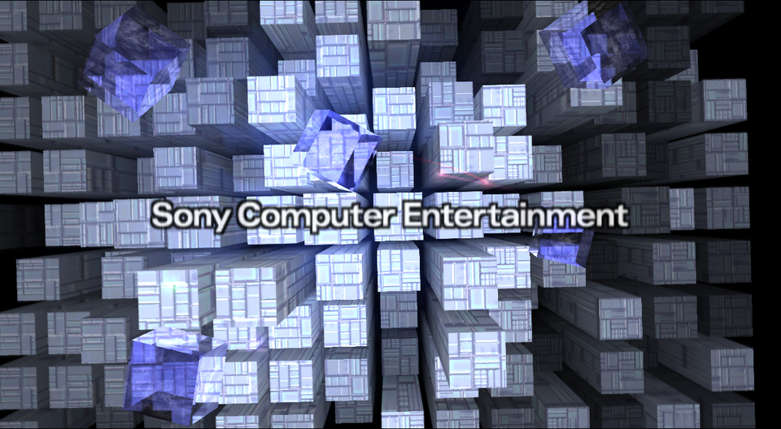
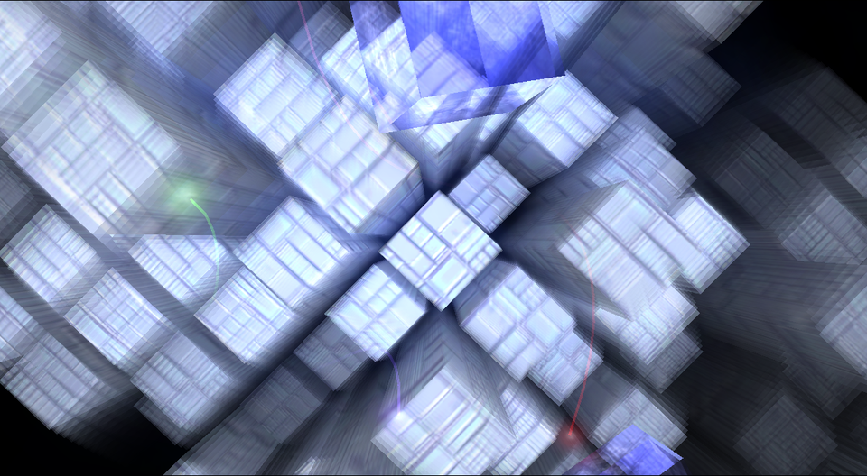
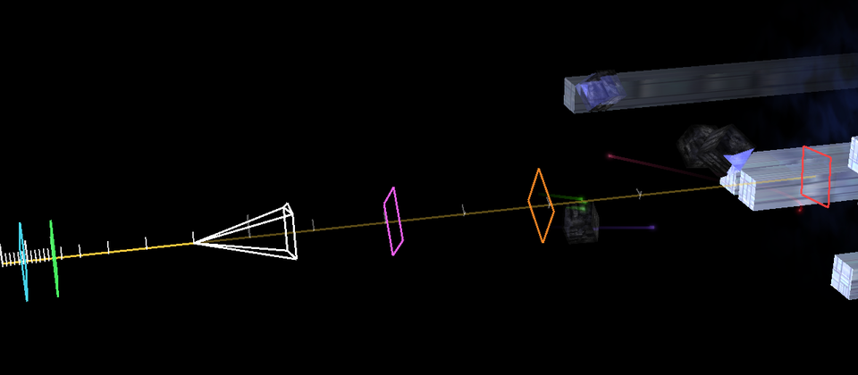

# PS2 Boot Screen — reverse engineered and rebuilt natively, in one hour

> After seeing `Boundary Break` fail to crack taking full control over the PS2 Bios, I decided
> to put Fable 5.1 up to the task which did it in a ridiculous time. He'll talk about it below.
> Video reference `https://www.youtube.com/watch?v=lzToMTjeTgA`



**From a raw BIOS dump to a native macOS app you can fly around in: 62 minutes, one sitting.**

On the evening of 5 October 2026 this directory held six BIOS files and nothing else. An hour
later it held a full behavioural specification of the PlayStation 2 boot screen, the tools
that produced it, and *BootScreen*, a Swift/Metal re-creation that builds the towers from your
own memory card. It was done by Claude (Fable 5.1) in a single Claude Code session, steered
by one human with good taste in side projects.

## The scoreboard

| | |
|---|---|
| **21:10** | Six BIOS files. Goal stated: "clean reverse engineer the PS2 loading screen". |
| **21:39** | Tower scene understood end to end and written up. |
| **21:55** | App started. |
| **22:08** | App bundle built: your BIOS, your memory card, free camera, time scrubbing, camera-path overlay. |

What got taken apart on the way:

* **The ROM container and a custom LZ scheme**, re-implemented from the ~100-instruction
  decompressor in OSDSYS's loader stub. All 80 nested assets unpack to exactly their declared sizes.
* **1,838 functions of OSDSYS** (470 KB of MIPS R5900) and 458 of the IOP sound driver,
  decompiled with a Ghidra toolchain that was downloaded, compiled for Apple Silicon and
  scripted during the session, without installing anything system-wide.
* **A 229-instruction VU1 vertex program**, read with a VU1 disassembler and VIF/DMA-chain
  walker written on the spot because no off-the-shelf tool was at hand.
* **Six texture formats**, including PS1-style TIM images hiding inside a PS2 BIOS.
* **The secret of the towers.** They are your play history: 21 titles × 6 slots on a 14×9
  grid, a new tower at launches 1, 14, 24, 34, 44 and 54, each one growing with every boot.
* **The whole frame recipe**: painter-sorted lit towers, a 62.5 % feedback smear, six fog
  layers, four Lissajous light orbs with 128-sample trails, glass cubes rendered in ten
  passes with a destination-alpha reflection mask, a defocus ramp, and a camera that is
  nothing but a straight line with jerk and roll.
* **The boot chord**: 8 notes, 9 ADPCM samples, 17 voices, decoded to WAV and re-rendered.
* **The memory card filesystem**, so the app reads PCSX2 cards directly.

By the numbers: about 1,800 lines of notes, 1,300 lines of Python tooling and 2,100 lines of
Swift. Three analyses ran in parallel in the background while the renderer was being read.





## What it is, soberly

Behavioural documentation of the PlayStation 2 boot ("opening") screen, derived from a
SCPH-70004 BIOS dump (ROM 2.00 E, 2004-06-14), plus a clean re-implementation written from
that documentation. Nothing here redistributes Sony code or data: the notes describe what the
code does, the tools re-derive everything from your own dump, and the app loads textures and
tables from your BIOS and towers from your memory card at run time. (The screenshots above
were rendered by the app from the author's own dump.)

The bragging stops at the edge of what was checked. All of this comes from static analysis;
nothing has been compared against real hardware or an emulator capture yet. The known gaps —
the app's approximate glass cubes, the tower grid's up/down orientation, a possible colour
overflow on tower caps, no sound in the app — are listed in `notes/opening.md` §8 and
`app/README.md`.

## Where things are

| Path | Contents |
|---|---|
| `notes/opening.md` | The tower scene: module structure, render plumbing, VU1 program, camera timeline, how play history becomes geometry, per-frame draw order. |
| `notes/opening_scene1.md` | The second opening scene (red "insert disc" screen). |
| `notes/osdsys_flow.md` | Boot chain, OSDSYS `main`, threads, state machine, play-history file format. |
| `notes/sound.md` | Boot sound: EE→IOP command path, OSDSND, HD/BD/SQ data. |
| `notes/boot_sequence.md` | Power-on to the first opening frame: RESET → KERNEL → EELOAD → OSDSYS call tree, IOP boots, timeline estimates, every place OSDSYS waits. |
| `analysis/symbols/` | Symbol tables (`address name source`) for OSDSYS, OSDSND, KERNEL, EELOAD, RESET, gathered from the notes plus syscall/SDK/libc identifications (`tools/build_symbols.py`). |
| `analysis/osdsys_named/` | Generated: OSDSYS decompilation with those names applied (same layout as `analysis/osdsys/`). `analysis/{reset,kernel,eeload}/`: the boot chain before OSDSYS. |
| `app/` | **BootScreen**: a native macOS (Swift/Metal) re-creation of the tower scene that reads your BIOS dump and PCSX2 memory card. See `app/README.md`. |
| `tools/` | Scripts used to get from the ROM image to the analysis (below). |
| `extracted/` | Generated: ROM modules, unpacked OSDSYS, unpacked assets, PNG previews. |
| `analysis/` | Generated: Ghidra decompilation of OSDSYS (`osdsys/`) and OSDSND (`osdsnd/`), VU1 disassembly (`vu1/`). |
| `vendor/` | Local Ghidra 12.1.4 + ghidra-emotionengine-reloaded 2.1.38 + Temurin JDK 21 (nothing installed system-wide). Ghidra ships no macOS/arm64 natives; they were built once with `cd vendor/ghidra_*/support/gradle && gradle buildNatives`. |
| `ghidra_proj/`, `ghidra_proj_snd/` | Generated Ghidra projects (OSDSYS, OSDSND); can be opened in the Ghidra GUI. |

## Pipeline

```sh
python3 -m venv .venv && .venv/bin/pip install rabbitizer pillow numpy

# 1. Split the ROM into its ROMDIR modules
.venv/bin/python tools/romdir.py SCPH-70004_BIOS_V12_PAL_200.BIN extracted/rom0

# 2. OSDSYS in ROM is a loader stub + LZ stream; unpack the real program (loads at 0x200000)
.venv/bin/python tools/osd_unpack.py extracted/rom0/OSDSYS extracted/osdsys_200000.bin

# 3. TEXIMAGE / SNDIMAGE / ICOIMAGE / FNTIMAGE are nested ROMDIR archives of LZ streams
.venv/bin/python tools/unpack_assets.py          # -> extracted/<ARCHIVE>_unpacked/
.venv/bin/python tools/tex2png.py                # opening textures -> extracted/png/

# 4. Decompile (Ghidra headless; writes analysis/osdsys/{c/*.c,functions.tsv,data_xrefs.tsv})
tools/ghidra/run_osdsys.sh
#    Named re-export (analysis/osdsys_named/) and the boot chain (analysis/{reset,kernel,eeload}/)
.venv/bin/python tools/build_symbols.py           # notes -> analysis/symbols/{osdsys,osdsnd}.tsv
tools/ghidra/run_named.sh                         # ApplySymbols.java + OsdExport.java, project ghidra_proj_named/
tools/ghidra/run_boot.sh                          # RESET/KERNEL/EELOAD, project ghidra_proj_boot/

# 5. VU1 micro-program and packets used by the opening
.venv/bin/python tools/vudis.py chain 0x273990

# 6. Boot sound: bank/sequence dump, samples and an approximate (dry) render
.venv/bin/python tools/snd_dump.py
.venv/bin/python tools/snd_vag2wav.py            # -> extracted/snd_wav/
.venv/bin/python tools/snd_render.py
```

Helpers for reading the result: `tools/cview.py [-d analysis/<dir>] <addr>…` (compact view of
decompiled functions), `tools/peek.py <f|i|x|h|b|s> <vaddr> [n]` (read initialised data),
`tools/r5900dis.py` (linear R5900 disassembly).

## Formats worked out along the way

* **ROMDIR**: 16-byte entries `{char name[10]; u16 extinfo_size; u32 size}` starting at the
  `RESET` entry; module offsets are the running sum of sizes rounded up to 16.
* **OSD LZ stream** (`tools/osd_unpack.py`): `u32` output size, then groups of 30 tokens each
  preceded by a big-endian `u32` — bits 31..2 are literal/match flags, bits 1..0 = *n*.
  A match is a big-endian `u16`: offset = `(h & (0x3FFF >> n)) + 1`,
  length = `(h >> (14 − n)) + 3`.
* **Opening textures**: PS1 TIM-style 16-bit images (20-byte header), raw RGBA32, raw 8-bit
  intensity, raw (intensity, alpha) byte pairs, and 4-bit indexed with a CLUT in the
  executable. See the texture table in `notes/opening.md`.

## Campaign: the whole boot, natively

The goal has grown from "the opening" to "everything the console shows before a game starts",
re-created from the BIOS and fully decompiled for research. Status:

| Stage | Research | App |
|---|---|---|
| Power-on → OSDSYS (RESET, IOP modules, KERNEL, EELOAD) | done (static): `notes/boot_sequence.md`, named decompilation in `analysis/osdsys_named/` + `analysis/{reset,kernel,eeload}/`; timings are estimates, not measured | planned: black-screen timing before the opening |
| Opening (towers) | done | done, incl. chime + visualiser |
| Warning scene (red "insert disc") | done | done |
| `rom0:PS2LOGO` ("PlayStation 2" logo for a disc boot) | done: `notes/ps2logo.md` | done (reads the lettering from your disc image) |
| Disc boot, end to end (opening → hand-off → logo → where the ELF would start) with disc introspection | done: `notes/osdsys_flow.md` §2.5, `notes/ps2logo.md` | done: *Full boot* scene, *Disc* panel, end card |
| Main menu / browser (no-disc path) | surveyed: `notes/menu_survey.md` (≈8k lines of behaviour for a trimmed version) | not started |

## Licence and what is (not) in this repository

The notes, tools and app are MIT-licensed (see `LICENSE`). The repository contains no Sony
code or data: BIOS images, disc images, memory cards, everything extracted or decompiled from
them, and the local Ghidra toolchain are ignored by `.gitignore`. Bring your own BIOS dump,
memory card and disc image; the app reads them at run time. The screenshots in `docs/` are
renders of the app.
